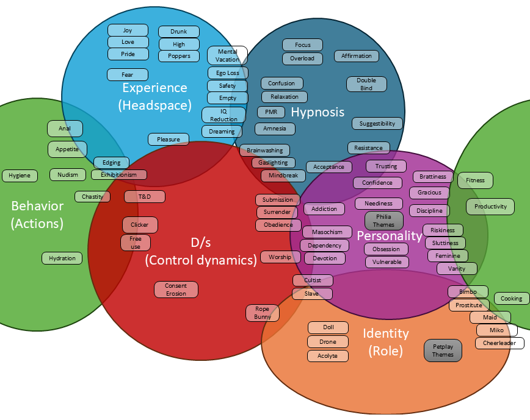

### Hypnosis  
**Description:**  
"*Does it describe how to induce or deepen a trance or hypnotic state?*"  
Contains fundamental hypnotic techniques and states. This includes induction methods, deepeners, suggestibility training, and other foundational elements that establish and maintain the hypnotic state, making it the core of trance work.  
**Examples:**  
- `Suggestibility` – increasing openness to hypnotic influence  
- `Confusion` – a technique/state to disorient and deepen trance  
- `Relaxation` – inducing a calm and receptive state

---

### Experience
**Description:**  
"*Does it describe an internal feeling?*"  
Encompasses emotional states, sensory perceptions, and altered mindsets. Content here aims to evoke feelings of joy, love, pride, or unique experiences like intoxication and trance, shaping one’s immediate emotional and sensory reality. VAKOG (Visual, Auditory, Kinesthetic, Olfactory, Gustatory) experiences are included.  
**Examples:**  
- `Emotion - Joy` – feeling happiness  
- `Inebriated - Drunk` – experiencing altered sensory/perception state  
- `Pleasure` – feeling a positive sensation  

---

### Personality
**Description:**  
"*Does it describe an internal trait or characteristic of the listener?*"  
Focuses on internal character traits, attitudes, and dispositions. Content here molds aspects like discipline, gratitude, obsession, or masochism, influencing enduring qualities that define who a person is at their core.  
**Examples:**  
- `Discipline` – the trait of self-control and commitment
- `Vanity` – an excessive focus on one's appearance
- `Vulnerability` – a state of emotional openness

---

### Behavior
**Description:**  
"*Is it an external or habitual action?*"  
Focuses on modifying or reinforcing tangible actions, habits, and responses. Content here guides how individuals act, comply, and adapt their behavior in various scenarios, influencing routines, obedience, and everyday conduct.  
**Examples:**  
- `Cooking` – changing daily action/skill  
- `Fitness` – improving habitual activity  
- `Productivity` – influencing efficiency in actions  

---

### Identity
**Description:**  
"*Does it describe a role or persona one adopts?*"  
Centers on adopting, reinforcing, or transforming roles and personas. Whether embracing a new archetype, roleplaying a specific character, or shifting self-image, content here helps shape and redefine who one becomes.  
**Examples:**  
- `Maid` – a servile caretaker identity  
- `Doll` – a passive, objectified persona  
- `Drone` – a mechanical, obedient role

---

### Domination/Submission
**Description:**  
"*Does it describe a power dynamic or control relationship?*"  
Focuses on power dynamics, control, and authority. Content here explores themes of dominance, submission, obedience, and servitude, shaping relationships, hierarchies, and interactions between individuals.  
**Examples:**  
- `Obedience` – relating to following orders in a power dynamic  
- `Surrender` – giving up control to another  
- `Worship` – one party reverently venerating another

---
