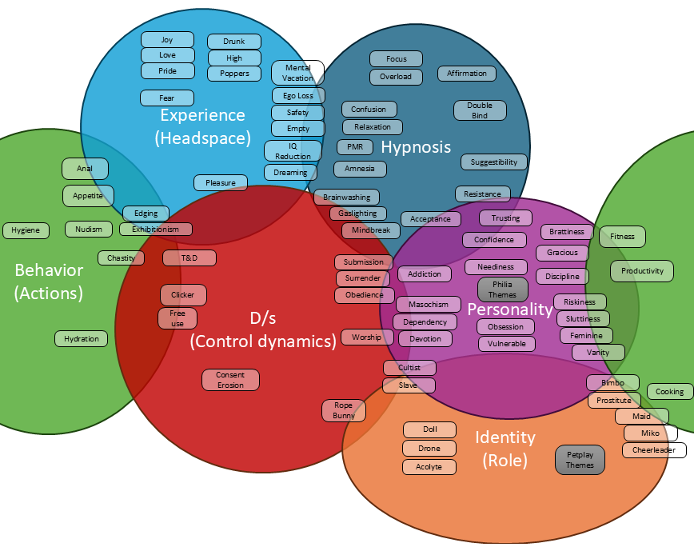

# Theme Overlap Chart

Below is a comprehensive table listing each theme alongside its approximate percentage overlap with the six categories: **Hypnosis**, **Experience**, **Personality**, **Behavior**, **Identity**, and **Domination/Submission (D/s)**. These percentages reflect the degree to which each theme aligns with each category based on their descriptions and ontological boundaries.

| **Theme**               | **Hypnosis (%)** | **Experience (%)** | **Personality (%)** | **Behavior (%)** | **Identity (%)** | **D/s (%)** |
|-------------------------|-------------------|---------------------|----------------------|-------------------|-------------------|-------------|
| **Behavior Themes**    |                   |                     |                      |                   |                   |             |
| Anal.txt                | 0                 | 20                  | 0                    | 80                | 0                 | 0           |
| Appetite.txt            | 0                 | 20                  | 0                    | 80                | 0                 | 0           |
| Chastity.txt            | 0                 | 10                  | 0                    | 70                | 0                 | 20          |
| Cooking.txt             | 0                 | 0                   | 0                    | 100               | 0                 | 0           |
| Edging.txt              | 0                 | 20                  | 0                    | 70                | 0                 | 10          |
| Exhibitionism.txt       | 0                 | 20                  | 0                    | 70                | 0                 | 10          |
| Fitness.txt             | 0                 | 0                   | 10                   | 90                | 0                 | 0           |
| Hydration.txt           | 0                 | 0                   | 0                    | 100               | 0                 | 0           |
| Hygiene.txt             | 0                 | 0                   | 0                    | 100               | 0                 | 0           |
| Nudism.txt              | 0                 | 0                   | 0                    | 100               | 0                 | 0           |
| Productivity.txt        | 0                 | 0                   | 10                   | 90                | 0                 | 0           |
| **Domination/Submission Themes** |         |                     |                      |                   |                   |             |
| Clicker.txt             | 0                 | 0                   | 0                    | 20                | 0                 | 80          |
| Consent Erosion.txt     | 0                 | 0                   | 0                    | 0                 | 0                 | 100         |
| Free Use.txt            | 0                 | 0                   | 0                    | 20                | 0                 | 80          |
| Gaslighting.txt         | 20                | 0                   | 0                    | 0                 | 0                 | 80          |
| Obedience.txt           | 0                 | 0                   | 0                    | 20                | 0                 | 80          |
| Rope Bunny.txt          | 0                 | 0                   | 0                    | 20                | 40                | 40          |
| Submission.txt          | 0                 | 0                   | 10                   | 0                 | 0                 | 90          |
| Surrender.txt           | 0                 | 0                   | 10                   | 0                 | 0                 | 90          |
| Tease and Denial.txt    | 0                 | 0                   | 0                    | 20                | 0                 | 80          |
| Worship.txt             | 0                 | 0                   | 0                    | 20                | 0                 | 80          |
| **Experience Themes**   |                   |                     |                      |                   |                   |             |
| Dreaming.txt            | 20                | 80                  | 0                    | 0                 | 0                 | 0           |
| Ego Loss.txt            | 20                | 80                  | 0                    | 0                 | 0                 | 0           |
| Emotion - Joy.txt       | 0                 | 100                 | 0                    | 0                 | 0                 | 0           |
| Emotion - Love.txt      | 0                 | 100                 | 0                    | 0                 | 0                 | 0           |
| Emotion - Pride.txt     | 0                 | 100                 | 0                    | 0                 | 0                 | 0           |
| Emptiness.txt           | 0                 | 100                 | 0                    | 0                 | 0                 | 0           |
| Fear.txt                | 0                 | 100                 | 0                    | 0                 | 0                 | 0           |
| Inebriated - Drunk.txt  | 0                 | 100                 | 0                    | 0                 | 0                 | 0           |
| Inebriated - High.txt   | 0                 | 100                 | 0                    | 0                 | 0                 | 0           |
| Inebriated - Poppers.txt| 0                 | 100                 | 0                    | 0                 | 0                 | 0           |
| IQ Reduction.txt        | 0                 | 100                 | 0                    | 0                 | 0                 | 0           |
| Mental Vacation.txt     | 20                | 80                  | 0                    | 0                 | 0                 | 0           |
| Pleasure.txt            | 0                 | 100                 | 0                    | 0                 | 0                 | 0           |
| Safety.txt              | 0                 | 100                 | 0                    | 0                 | 0                 | 0           |
| **Hypnosis Themes**     |                   |                     |                      |                   |                   |             |
| Acceptance.txt          | 80                | 0                   | 20                   | 0                 | 0                 | 0           |
| Affirmation.txt         | 100               | 0                   | 0                    | 0                 | 0                 | 0           |
| Amnesia.txt             | 100               | 0                   | 0                    | 0                 | 0                 | 0           |
| Brainwashing.txt        | 80                | 0                   | 0                    | 0                 | 0                 | 20          |
| Confusion.txt           | 100               | 0                   | 0                    | 0                 | 0                 | 0           |
| Double Bind.txt         | 100               | 0                   | 0                    | 0                 | 0                 | 0           |
| Focus.txt               | 100               | 0                   | 0                    | 0                 | 0                 | 0           |
| Mindbreak.txt           | 80                | 0                   | 0                    | 0                 | 0                 | 20          |
| Overload.txt            | 100               | 0                   | 0                    | 0                 | 0                 | 0           |
| PMR.txt                 | 100               | 0                   | 0                    | 0                 | 0                 | 0           |
| Relaxation.txt          | 100               | 0                   | 0                    | 0                 | 0                 | 0           |
| Resistance.txt          | 100               | 0                   | 0                    | 0                 | 0                 | 0           |
| Suggestibility.txt      | 100               | 0                   | 0                    | 0                 | 0                 | 0           |
| **Identity Themes**     |                   |                     |                      |                   |                   |             |
| Acolyte.txt             | 0                 | 0                   | 0                    | 0                 | 100               | 0           |
| Bimbo.txt               | 0                 | 0                   | 20                   | 0                 | 80                | 0           |
| Cheerleader.txt         | 0                 | 0                   | 0                    | 0                 | 100               | 0           |
| Cultist.txt             | 0                 | 0                   | 0                    | 0                 | 100               | 0           |
| Doll.txt                | 0                 | 0                   | 0                    | 0                 | 100               | 0           |
| Drone.txt               | 0                 | 0                   | 0                    | 0                 | 100               | 0           |
| Maid.txt                | 0                 | 0                   | 0                    | 0                 | 100               | 0           |
| Miko.txt                | 0                 | 0                   | 0                    | 0                 | 100               | 0           |
| Petplay_Bunny.txt       | 0                 | 0                   | 0                    | 0                 | 100               | 0           |
| Petplay_Cow.txt         | 0                 | 0                   | 0                    | 0                 | 100               | 0           |
| Petplay_Fox.txt         | 0                 | 0                   | 0                    | 0                 | 100               | 0           |
| Petplay_Kitten.txt      | 0                 | 0                   | 0                    | 0                 | 100               | 0           |
| Petplay_Puppy.txt       | 0                 | 0                   | 0                    | 0                 | 100               | 0           |
| Prostitute.txt          | 0                 | 0                   | 0                    | 20                | 80                | 0           |
| Slave.txt               | 0                 | 0                   | 0                    | 0                 | 60                | 40          |
| **Personality Themes**  |                   |                     |                      |                   |                   |             |
| Addiction.txt           | 0                 | 0                   | 100                  | 0                 | 0                 | 0           |
| Brattiness.txt          | 0                 | 0                   | 90                   | 0                 | 0                 | 10          |
| Confidence.txt          | 0                 | 0                   | 100                  | 0                 | 0                 | 0           |
| Dependency.txt          | 0                 | 0                   | 100                  | 0                 | 0                 | 0           |
| Devotion.txt            | 0                 | 0                   | 100                  | 0                 | 0                 | 0           |
| Discipline.txt          | 0                 | 0                   | 100                  | 0                 | 0                 | 0           |
| Feminine.txt            | 0                 | 0                   | 100                  | 0                 | 0                 | 0           |
| Gracious.txt            | 0                 | 0                   | 100                  | 0                 | 0                 | 0           |
| Masochism.txt           | 0                 | 0                   | 80                   | 0                 | 0                 | 20          |
| Neediness.txt           | 0                 | 0                   | 100                  | 0                 | 0                 | 0           |
| Obsession.txt           | 0                 | 0                   | 100                  | 0                 | 0                 | 0           |
| Riskiness.txt           | 0                 | 0                   | 100                  | 0                 | 0                 | 0           |
| Sluttiness.txt          | 0                 | 0                   | 80                   | 20                | 0                 | 0           |
| Somnophilia.txt         | 0                 | 0                   | 100                  | 0                 | 0                 | 0           |
| Trusting.txt            | 0                 | 0                   | 100                  | 0                 | 0                 | 0           |
| Vanity.txt              | 0                 | 0                   | 100                  | 0                 | 0                 | 0           |
| Vulnerable.txt          | 0                 | 0                   | 100                  | 0                 | 0                 | 0           |

---

**Note:**  
- The percentages are approximate and reflect the primary alignment of each theme with the categories.  
- Some themes exhibit overlaps across multiple categories, as indicated by the distribution of percentages.  
- This table can be used to visualize the connectivity between the six categories and understand the predominant categorization for each theme.

## Summary of Ontological Boundaries

- **Hypnosis:** Techniques and methods to induce or deepen trance states.
- **Experience:** Internal feelings, emotions, and sensory perceptions.
- **Personality:** Internal traits and characteristics that define core aspects of the individual.
- **Behavior:** External actions, habits, and responses.
- **Identity:** Roles and personas that one adopts.
- **Domination/Submission (D/s):** Power dynamics and control relationships.

## Mnemonic Guide for Categorization

To determine where a new theme fits, ask yourself the following concise questions:

- **Hypnosis:**  
  *"Does it describe how to induce or deepen a trance or hypnotic state?"*

- **Experience:**  
  *"Does it describe an internal feeling?"*

- **Personality:**  
  *"Does it describe an internal trait or characteristic of the listener?"*

- **Behavior:**  
  *"Is it an external or habitual action?"*

- **Identity:**  
  *"Does it describe a role or persona one adopts?"*

- **Domination/Submission:**  
  *"Does it describe a power dynamic or control relationship?"*

By using these targeted questions, you can efficiently categorize new themes into the appropriate folders.

## Average Overlap and Connectivity

Analyzing the table reveals that most themes predominantly align with a single category, with minimal overlaps. However, certain themes like **Chastity.txt**, **Edging.txt**, **Exhibitionism.txt**, and **Rope Bunny.txt** show significant overlaps with both **Behavior** and **Domination/Submission** or **Identity**. This indicates strong connectivity between these categories, particularly where behavioral actions are intertwined with power dynamics or role adoption.

---
